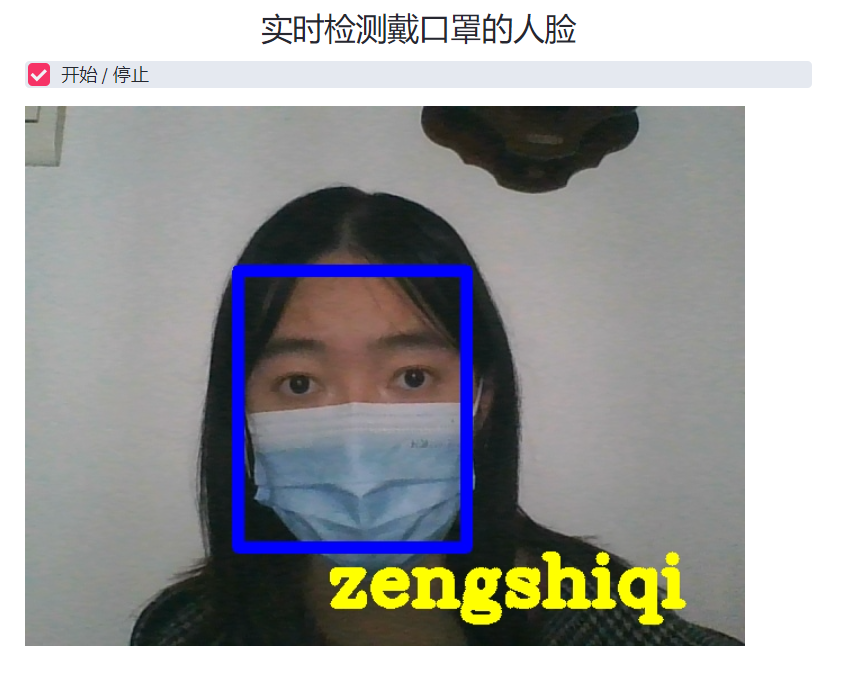

# 基于Streamlit的口罩人脸识别系统

本项目对[Masked-Face-Recognition-using-Facenet](https://github.com/Nagasai524/Masked-Face-Recognition-using-Facenet)项目进行了修改，在此基础上实现了实时的口罩人脸识别。

人脸识别使用MTCNN和FaceNet进行训练，使用Streamlit进行部署。


## 我使用的Python包版本

```
Keras                   2.4.3
Keras-Preprocessing     1.1.2
mtcnn                   0.1.1
opencv-contrib-python   4.3.0.38
opencv-python           4.3.0.38
tensorflow              2.6.2
Pillow                  5.4.1
numpy                   1.19.4
matplotlib              3.3.1
streamlit               1.6.0
scipy                   1.5.4
```

如果运行项目的过程中出现一些奇怪的报错，可以尝试将Python包换成以上版本。

如果使用pip安装以上包的速度太慢，可以使用镜像源。如使用豆瓣镜像源下载streamlit：

```
pip install -i http://pypi.douban.com/simple/ --trusted-host pypi.douban.com streamlit
```


## 项目文件目录

* `dataset`：数据集，应将同一人的训练图片应放到“`dataset\姓名`”目录下。
* `facenet.h5`：训练的模型。
* `trainer.py`：训练数据集的代码。
* `recognizer.py`：部署Streamlit、实现口罩人脸识别的代码。


## 运行项目

1. **收集图像**：将人脸图像放到`dataset`目录中。这些图片可以是戴口罩图片或不戴口罩图片。

2. **生成embeddings**：运行`trainer.py`这一文件。在命令行使用以下命令生成`data.npz`文件

   ```
   python trainer.py
   ```

3. **部署Streamlit**：在命令行使用以下命令进行部署

   ```
   streamlit run recognizer.py
   ```

以上就可以在浏览器访问`http://localhost:8501/`使用该系统实现口罩人脸识别。


## 系统功能及演示

### 上传戴口罩的人脸图片

点击`“Browse files”`上传口罩人脸图片，实现人脸识别。


### 实时检测戴口罩的人脸

点击`“开始/停止”`打开摄像头，实时检测口罩人脸。



（注意：“实时检测戴口罩的人脸”功能无法在服务器上使用，因为Streamlit调用的不是客户机的摄像头。）
